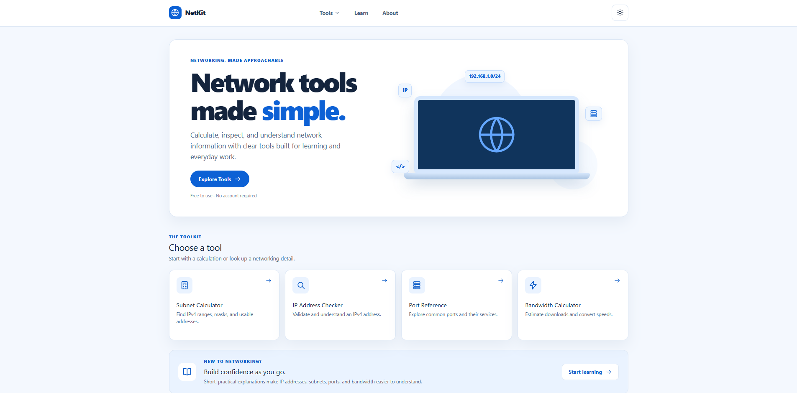

# NetKit

A beginner-friendly networking toolkit for subnet calculations, IPv4 inspection, port references, and bandwidth utilities.

[Live Demo](https://mynetkit.vercel.app/) • [GitHub Repository](https://github.com/joshuaansiboy/netkit)



## About NetKit

NetKit is a collection of simple browser-based networking tools designed to make common networking calculations and references easier to understand.

It is built for IT and networking students, developers, and anyone learning networking fundamentals.

## Features

- Subnet Calculator
- CIDR / Binary Visualizer
- IPv4 Address Checker
- Port Reference
- Bandwidth / Download Time Calculator
- Speed Converter
- Networking Learn section
- Light and Dark themes
- Responsive design for desktop, tablet, and mobile
- Quick copy actions for useful results
- Helpful input validation and error states

## Networking Tools

### Subnet Calculator

Calculate important IPv4 subnet information including:

- Subnet mask
- Wildcard mask
- Network address
- Broadcast address
- First and last conventional host
- Total addresses
- Usable host count

NetKit also handles `/31` point-to-point networks and `/32` host routes appropriately.

### CIDR / Binary Visualizer

Visualize a 32-bit IPv4 address and see how CIDR prefixes divide the address into network and host bits.

### IP Address Checker

Validate and inspect IPv4 addresses while identifying common private and special-purpose ranges such as:

- Private addresses
- Loopback
- Link-local
- Shared / CGNAT
- Documentation ranges
- Benchmarking ranges
- Multicast
- Unspecified and limited broadcast addresses

The checker performs local classification only. It does not perform IP geolocation or live network lookups.

### Port Reference

Search a curated reference of commonly used network ports and protocols, including services such as HTTP, HTTPS, SSH, DNS, SMTP, PostgreSQL, MySQL, and more.

The Port Reference is informational only and does not scan your device or network.

### Bandwidth Calculator

Estimate theoretical file transfer or download time using a file size and network connection speed.

### Speed Converter

Convert between supported network speed units such as Kbps, Mbps, and Gbps.

## Tech Stack

- **Next.js**
- **React**
- **TypeScript**
- **Tailwind CSS**

The application uses the Next.js App Router and separates networking calculation logic from the user interface.

## Privacy

NetKit is designed to perform its networking calculations locally without requiring:

- User accounts
- Database storage
- Analytics or tracking
- External IP lookup APIs

Tool inputs are not stored in a database. Theme preference may be saved locally in the browser so the selected appearance can persist between visits.

## Getting Started

Clone the repository:

```bash
git clone https://github.com/joshuaansiboy/netkit.git
